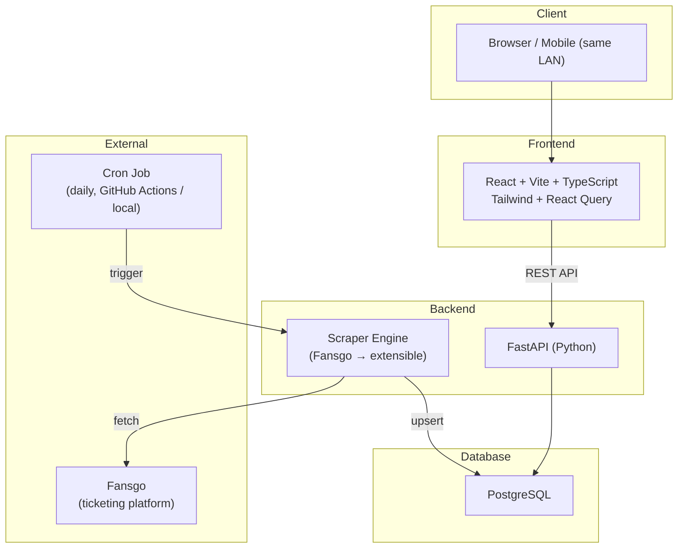
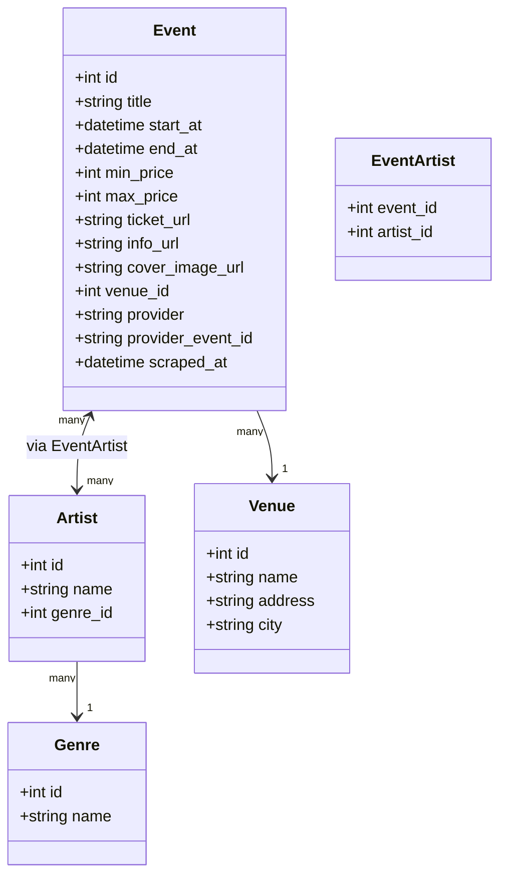
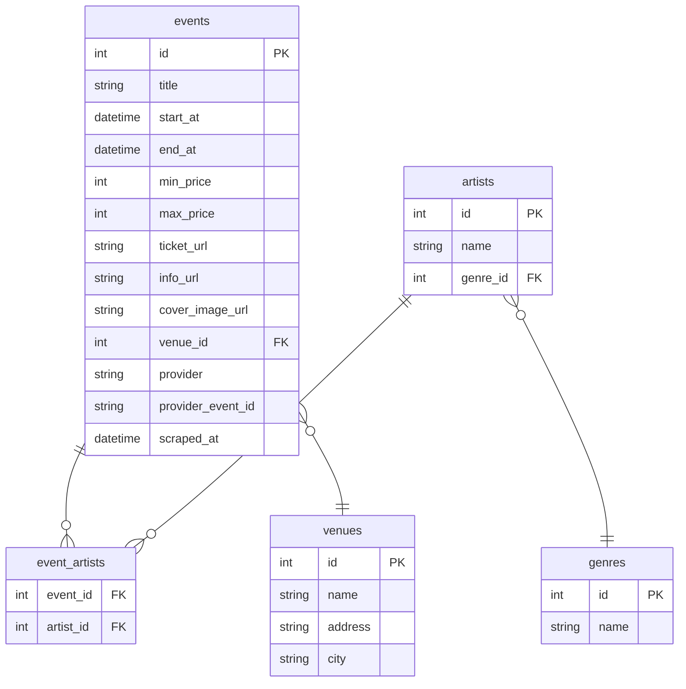
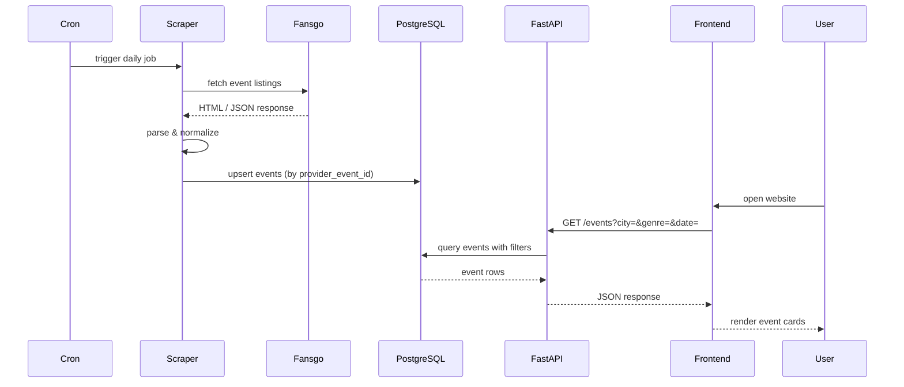
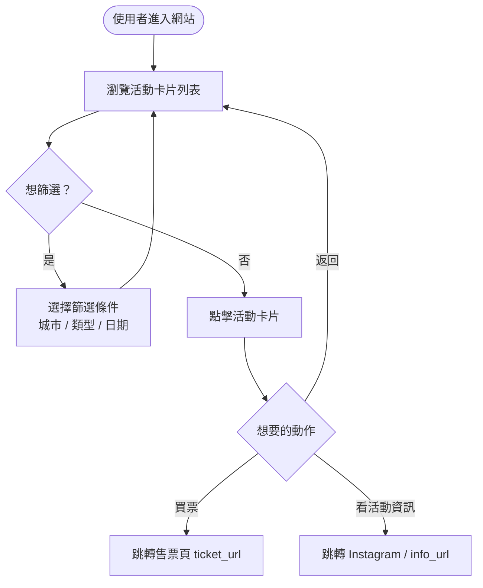

# Planning: live-event-aggregator

## Overview

一個聚合台灣音樂活動資訊的網站，從各售票平台爬取活動資料（MVP 以 Fansgo 為起點），以卡片形式呈現活動的時間、地點、票價、表演者與售票連結，供喜歡聽音樂的使用者瀏覽與篩選。部署目標：第一階段本機區網可用，第二階段自架伺服器公開上線。

---

## Architecture Diagram

---

## Class Diagram

---

## DB Schema

---

## Sequence Diagram

---

## User Flow

---

## External Dependencies

| Service | Purpose | Auth Required |
|---------|---------|---------------|
| Fansgo | 爬取活動資料（MVP 起點） | 否（公開頁面） |
| GitHub Actions | 每日定時觸發爬蟲（免費 cron） | GitHub token |
| Google Calendar | 使用者訂閱活動行事曆 | **Postponed** |

---

## Deployment Plan

| 階段 | 方式 | 說明 |
|------|------|------|
| Phase 1 | 本機 + Docker Compose | 區網內電腦與手機皆可存取 |
| Phase 2 | 自架伺服器（Render / Railway / VPS）| 公開上線，社群使用 |

提供 `docker-compose.yml`，讓想自行部署的人也能一鍵啟動。

---

## Open Questions

留給 `/pm` 討論：

1. **TA 導向過濾條件**：爬蟲要排除哪些類型的活動？（例如：只抓獨立音樂、排除大型商演）條件由人工設定還是標籤自動化？
2. **活動更新與下架**：Fansgo 活動取消或售完時，網站如何處理？（隱藏 / 標記 / 刪除）
3. **票價顯示規則**：無票價資訊時顯示「免費」還是「待確認」？
4. **多 Provider 擴充介面**：之後加入 KKTIX、Accupass 等，Scraper 要設計 base class 還是 plugin 架構？
5. **封面圖片**：若 Fansgo 無圖或圖片失效，前端卡片的 fallback 設計？

<!-- Last updated: 2026-04-09 18:00 -->
